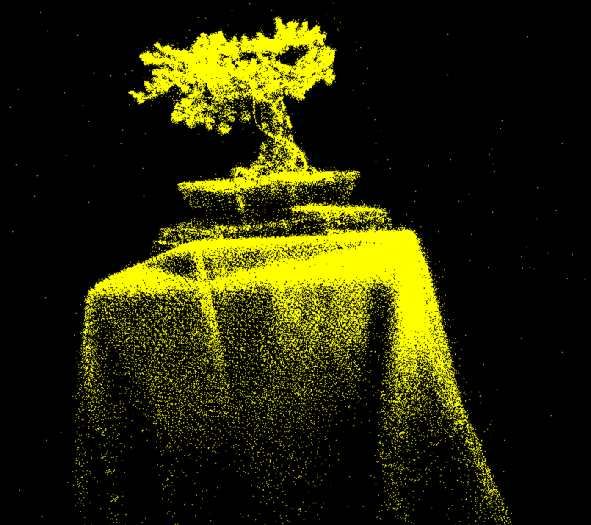

# Project5-WebGPU-Gaussian-Splat-Viewer

**University of Pennsylvania, CIS 565: GPU Programming and Architecture, Project 5**

* Anya Agarwal
  * [LinkedIn](https://www.linkedin.com/in/anya-agarwal/)
* Tested on: **Google Chrome 141.0.7390.55** on
  Windows 11, AMD Ryzen 7 260 @ 380GHz 16GB, RTX 5060

### Live Demo

Click on the image to view the live demo website! (Source files must be loaded in to run the program).

  

### Demo Video/GIF

## Overview
This project implements the [3D Gaussian Splatting paper](https://repo-sam.inria.fr/fungraph/3d-gaussian-splatting/), but coded with the WebGPU API. Gaussian splats involve taking a point cloud depicting a 3D scene, and representing the points as ellipsoids defined by position, color, opacity, and size. Instead of using triangles to render out a 3D scene, we project information to a 2D space; the resulting 2D Gaussian splat ellipsoids blend with each other to create a realistic view of the object and of the whole scene.

### Preprocess Pipeline
To take advantage of the parallelism and pipeline setup that WebGPU offers, I first calculate information about the Gaussian splat in a preprocessing pipeline. This compute shader involves calculating a 3D covariance matrix based on rotation and scale of the Gaussian, and then projects it into a 2D space to get the conic and radius information of the splat ellipsoid. To get the color of the splat, I use spherical harmonic coefficients along with the direction of the camera. For a performance improvement, I also culled the splats with a bounding box of 1.2x the size of the camera view frustum. This helps limit the number of splats actually rendered to be only ones we see, instead of calculating and rendering every splat. All of this computed information about the splats are then sent to the vertex and fragment shaders. 

To ensure that splats are drawn in the correct order, I sort the Gaussians based on their depth and store the sorted indices in a buffer. This way, the splats further away and behind others are drawn first, ensuring that the closest splats are seen by the camera first. This step is actually completed in a radix sort compute pass, which results in the buffer with sorted indices that can be passed into the vertex shader.

### Indirect Draw Pipeline
The indirect draw pipeline handles the vertex and fragment shaders, and creates the splats on the screen based on the information calculated from the preprocess pipeline. The preprocess pipeline gives a count of how many quads should be drawn, and the render pipeline takes this value to indirectly render out the corresponding quads. The vertex shader constructs the quad based on splat data, and the fragment shader outputs the final color of the splat by applying a Gaussian opacity falloff to get a blended effect. 

## Performance Analysis
I use a metric of milliseconds per frame to analyze performance. This means that lower numbers are more desired and correspond to better performance time.

**Compare your results from point-cloud and gaussian renderer, what are the differences?**

| Bonsai Point Cloud (6.06 ms) | Bonsai Gaussian Renderer (9.90 ms) | 
|------------------------|------------------------|
| |  |

The point-cloud renderer shows every splat in the 3D scene as a dot of the same color, size, and opacity as all the other points. The general shape of the object can be picked up based on the locations of the points in the point cloud, but the final render does not produce a realistic scene. On the other hand, the gaussian renderer changes the size, color, and opacity of each splat, which all blend together to create a realistic image. This realism holds even when the camera angle is changed, as there are new gaussian splat calculations being performed for the new camera view space. We can expect that the performance of the point cloud is better than the gaussian renderer, since the gaussian renderer requires extra information and processing to get to the final result.

**For gaussian renderer, how does changing the workgroup-size affect performance? Why do you think this is?**

| Workgroup Size | Performance Time |
| -------------- | ---------------- |
| 64             | 21.30 ms         |
| 128            | 11.21 ms         |
| 256            | 9.90 ms          |

It seems that the performance decreases as the workgroup size decreases. This makes sense since a smaller workgroup size corresponds to a larger number of groups that the GPU must run and manage. With a larger workgroup size on the other hand, more work is able to be done in parallel, speeding up the overall process. From this analysis, a workgroup size of 256 would be most ideal for the gaussian splatting.

**Does view-frustum culling give performance improvement? Why do you think this is?**

| Without Culling | With Culling |
| --------------- | ------------ |
| 9.92 ms         | 9.90 ms      |

Theoretically, view-frustum culling would give a performance improvement. But interestingly, it doesn't seem to speed up the overall render time by very much at all. This could be because GPU parallelization is already hiding a lot of the time for the work being done for a larger number of splats. So even if the culling allows less splats to be rendered, there isn't a speedup since the pipeline setup would allow those extra splats to be rendered with a similar fast speed anyway.

**Does number of gaussians affect performance? Why do you think this is?**

| Number of Gaussians | Performance Time |
| ------------------- | ---------------- |
| 272,956             | 6.06 ms          |
| 1,063,091           | 9.90 ms          |

Increasing the number of gaussians in the scene would reduce performance, especially as the number gets quite large past 1 million gaussians. According to the performance times, a scene with around 300,000 gaussians renders at the monitor frame rate. However, when increasing to around 1,000,000 gaussians, there is a bit of a slowdown, which would only get worse as the number of gaussians increases dramatically. This is simply because of the amount of work needed for each gaussian. These extra computations increase the performance time at a certain point as resources start to run out and workload gets heavier.

### Credits

- [Vite](https://vitejs.dev/)
- [tweakpane](https://tweakpane.github.io/docs//v3/monitor-bindings/)
- [stats.js](https://github.com/mrdoob/stats.js)
- [wgpu-matrix](https://github.com/greggman/wgpu-matrix)
- Special Thanks to: Shrek Shao (Google WebGPU team) & [Differential Guassian Renderer](https://github.com/graphdeco-inria/diff-gaussian-rasterization)
